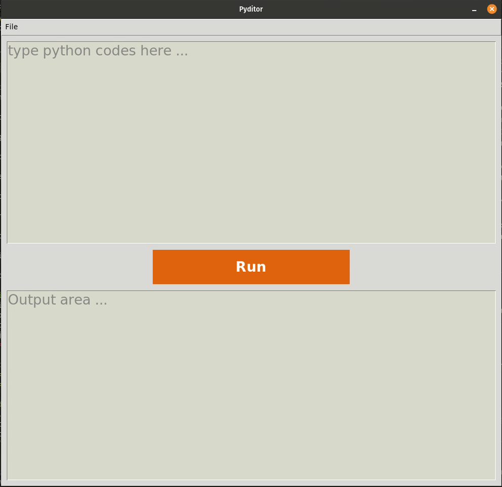

# pyditor
## A minimalist Python runner for coding interviews

Pyditor is a lightweight, standalone Python code editor and runner built with Tkinter. It provides a simple interface for writing and executing Python code with syntax highlighting and real-time output display. Perfect for coding interviews, quick prototyping, and learning Python.

<p align="center">
    
</p>

## Features

- **Clean UI**: Minimalist interface with syntax highlighting for Python code
- **Instant Execution**: Run Python code with a single click
- **Real-time Output**: Displays stdout, stderr, and execution status
- **Syntax Highlighting**: Color-coded keywords, strings, comments, numbers, and built-in functions
- **Multi-monitor Support**: Automatically centers window on the active monitor (Linux/xrandr)
- **File Operations**: Save code snippets for later use
- **Timeout Protection**: Automatic timeout after 5 seconds to prevent infinite loops

## Installation

### Prerequisites
- Python 3.6 or higher
- Tkinter (usually included with Python)

### Setup

Clone the repository and run:
```bash
python main.py
```

No additional dependencies required - uses only Python standard library.


## Keyboard Shortcuts

The application uses standard Tkinter text widget shortcuts:
- **Ctrl+A**: Select all
- **Ctrl+C**: Copy
- **Ctrl+V**: Paste
- **Ctrl+X**: Cut
- **Ctrl+Z**: Undo


## License

MIT License - see [LICENSE](LICENSE) for details

## Use Cases

- Coding interviews and technical assessments
- Quick Python prototyping and testing
- Learning Python syntax and features
- Code snippet testing without IDE overhead
- Teaching Python programming basics

## Contributing

This is a minimalist tool by design. If you find bugs or have suggestions, feel free to open an issue or submit a pull request.
